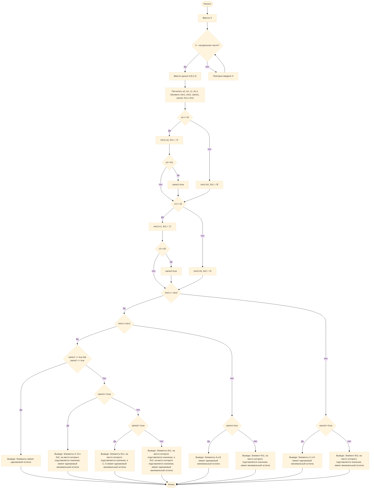

```mermaid
%%{
  init: {
    'theme': 'base', 
     'themeVariables': {
        'fontSize': '90%'
      }
     }
}%%


graph TD
 A([Начало]) --> B[Ввести X]
 B --> C{X - натуральное число?}
 C -- "Да" --> D[Ввести целые A,B,C,D]
 C -- "Нет" --> D1[Повторно введите X]
 D1 --> C
 D --> E[Посчитать a1, b1, c1, d1 и объявить min1, min2, same1, same2, fin1 и fin2]
 E --> F{a1<= b1}
 F -- "Да" --> F3[min1=a1, fin1 = 'A']
 F -- "Нет" --> F4[min1=b1, fin1 = 'B']
 F3 --> F1{a1==b1}
 F1 -- "Да" --> F2[same1=true]
 F1 -- "Нет" --> G{с1<= d1}
 F2 --> G
 F4 --> G
 G -- "Да" --> G3[min2=c1, fin2 = 'C']
 G -- "Нет" --> G4[min2=d1, fin2 = 'D']
 G3 --> G1{c1==d1}
 G1 -- "Да" --> G2[same2=true]
 G1 -- "Нет" --> K{min1<= min2}
 G2 --> K
 G4 --> K
 K -- "Да" --> K1{min1==min2}
 K1 -- "Да" --> K2{same1 == true && </br> same2 == true}
 K2 -- "Да" --> P1[Выведи: Элементы имеют одинаковый остаток]
 K2 -- "Нет" --> K4{same1==true}
 K4 -- "Да" --> P2[Выведи: Элементы A, B и fin2, на место которого подставляется значение, имеют одинаковый минимальный остаток]
 K4 -- "Нет" --> K5{same2==true}
 K5 -- "Да" --> P3[Выведи: Элементы fin1, на место которого подставляется значение, и C, D имеют одинаковый минимальный остаток]
 K5 -- "Нет" --> P4[Выведи: Элементы fin1, на место которого подставляется значение, и fin2, на место которого подставляется значение, имеют одинаковый минимальный остаток]
 K1 -- "Нет" --> K7{same1=true}
 K7 -- "Да" --> P7[Выведи: Элементы A и B имеют одинаковый минимальный остаток]
 K7 -- "Нет" --> P8[Выведи: Элемент fin1, на место которого подставляется значение, имеет минимальный остаток]
 K -- "Нет" --> K9{same2==true}
 K9 -- "Да" --> P9[Выведи: Элементы C и D имеют одинаковый минимальный остаток]
 K9 -- "Нет" --> P10[Выведи: Элемент fin2, на место которого подставляется значение, имеет минимальный остаток]
 P1 --> Z([Конец])
 P2 --> Z
 P3 --> Z
 P4 --> Z
 P7 --> Z
 P8 --> Z
 P9 --> Z
 P10 --> Z
```
