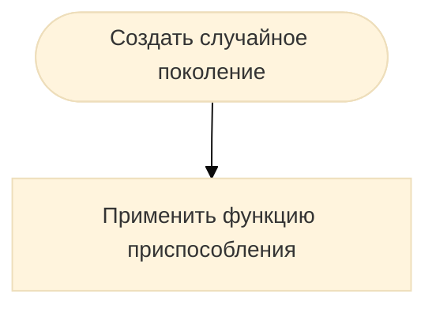

```mermaid
%%{
  init: {
    'theme': 'base', 
     'themeVariables': {
        'fontSize': '90%'
      }
     }
}%%


graph TD
 A([Создать случайное поколение]) --> B[Применить функцию приспособления]
```
